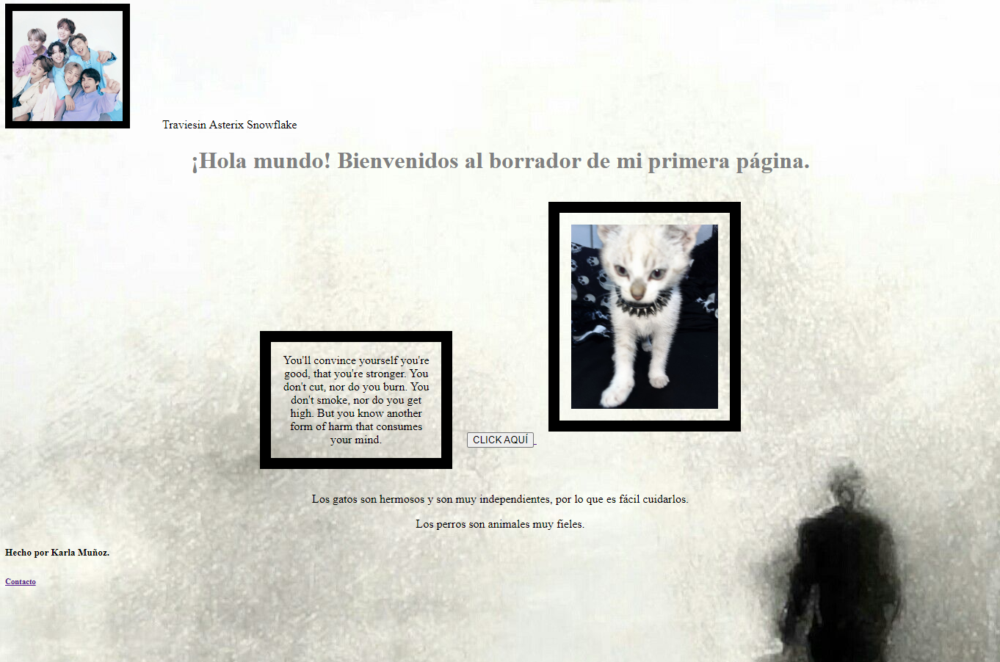

# Primera página hecha en TECHNOLOCHICAS PRO

El presente proyecto es un portafolio desarrollado para poner en práctica las habilidades obtenidas dentro del bootcamp de desarrollo frontend de Technolochicas PRO.

Fue desarrollado con HTML y CSS.

La página es responsiva (adaptable a diferentes tamaños de pantalla).

[Proyecto Desplegado (https://pagina-borrador.vercel.app/)](https://pagina-borrador.vercel.app/)

## Secciones de sitio.

## Tecnologías.

* HTML
* CSS

———

Desarrollado por Karla Muñoz en el curso de TECHNOLOCHICAS PRO.